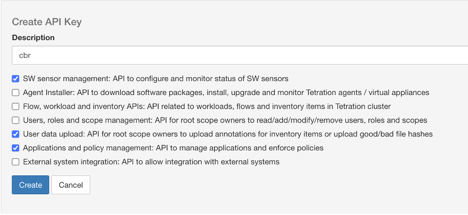
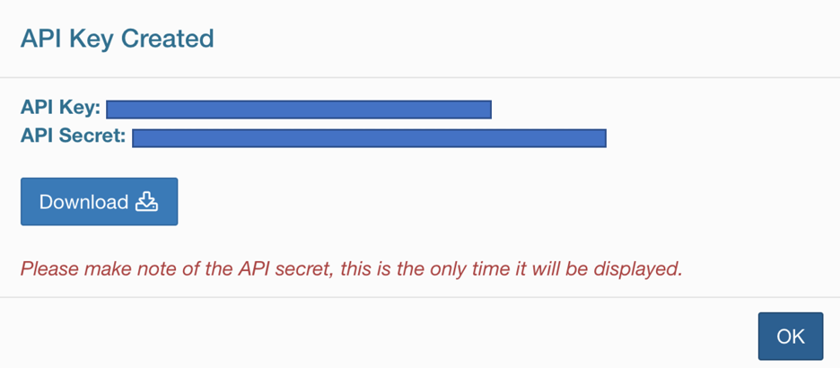

                   ###### **Secure Workload Configuration Backup and Restore**

the purpose of this script, is to help automate the process of downloading the current configurations listed below:

- Sensors list in JSON format.
- Inventor filters in JSON format.
- user uploaded labels (Annotation file) in CSV format.
- Scope tree in JSON format.
- Workspaces in JSON format.
- policies of each workspace in JSON format.

In this release we will include only the backup part, in future we will add the restore functionality.

###### **how to run the code:**

clone the repo to your local machine.

_git clone https://github.com/majundi/cbr.git_

install the requirements on python3 virtual environment.

_python3 -m venv env_

_source env/bin/activate_

_pip install -r requirements.txt_

edit the settings.ini file and fill the required settings.

from Tetration tenant, generate the API_KEY, and API_SECRET.
required APIs: SW Sensor Management, User Data Upload and Application and Policy Management.

copy the keys to settings.ini

run the code.

_python cbr.py_

